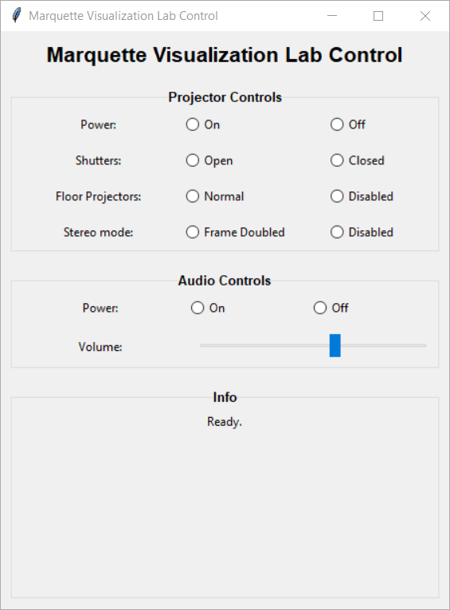

# CaveControl
 One day in late 2020, upon returning to campus, I was disappointed to discover that the Crestron touchscreen that I use to control the 10 projectors in [The Marquette University Visualization Lab](https://www.eng.mu.edu/vizlab/) had died after months of neglect during the Covid-19 shutdown. Instead of replacing the unit, I decided to make a simple Python GUI to trigger the most common daily tasks of the Cave: powering on/off, opening/closing shutters, enabling/disabling stereoscopic 3D mode, and enabling/disabling the floor projectors.
 
 

 The program is made in Python 3.9, and the GUI is made in TKinter with TTK. It is designed to be simple and cross-platform, and so it uses standard libraries exclusively and has no additional dependencies. "Build.bat" is an included shortcut that will build a standalone executable using PyInstaller, if desired.
 
 In order to be useful for other Caves, some modification to the code will be required. The IPs and available commands are coded into christie.py. To discover additional commands or their parameters, consult the serial command API reference, ["M Series Serial API Commands Tech Ref.pdf"](https://www.christiedigital.com/globalassets/resources/public/020-100224-11-christie-lit-tech-ref-m-series-serial-commands.pdf), from Christie's website. The program is designed for use with Christie WU7K-M projectors, but should work similarly with other makes and models with slight adjustment to the commands.
 
 Special Thanks to [jmusarra](https://github.com/jmusarra), whose [Pyjector](https://github.com/chrislarkee/Pyjector) was useful for emulating the projectors while working from home.
 
 Written by Chris Larkee, 5/7/21.

## Instructions

### For the command line:
- Type "python christie.py" to see a list of available commands for the projector. For example, "python christie.py on" , will turn on all 10 projectors.
- Type "python marantz.py" to see a list of available commands for the audio system.

```
$ python christie.py
Valid Commands:
 on             Turn on all projectors
 off            Turn off all projects
 open           Open shutters (unmute video)
 close          Close shutters (mute video)
 floorOn        Enable floor projectors
 floorOff       Disable floor projectors
 3d             Enable frame-packed stereo
 2d             Disable stereo
 ping           Query power state
 test           Secret debug command
```

### For the GUI:
- Run "python caveControl.py" , or CaveControl.exe. 
- Click on a command's radio button to send the command to all 10 projectors. Status text will appear at the bottom when all tasks are complete.
- Press ESCAPE to quit, or close the window.

## License
[GNU GPL v3](LICENSE.md)
