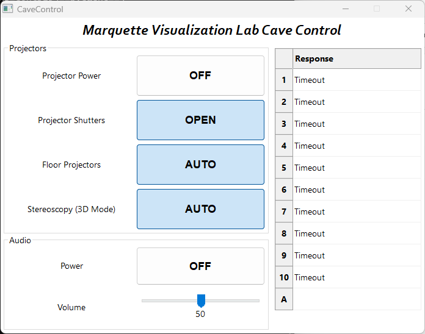

# CaveControl
 One day in late 2020, upon returning to campus, I was disappointed to discover that the Crestron touchscreen that I use to control the 10 projectors in [The Marquette University Visualization Lab](https://www.eng.mu.edu/vizlab/) had died after months of neglect during the Covid-19 shutdown. Instead of replacing the unit, I decided to make a simple Python GUI to trigger the most common daily tasks of the Cave: powering on/off, opening/closing shutters, enabling/disabling stereoscopic 3D mode, and enabling/disabling the floor projectors.
 
 
 
 In order to be useful for other Caves, some minor modification to the code will be required, such as IP remapping in the "Transmit" class. To discover additional commands or their parameters, consult the serial command API reference, ["M Series Serial API Commands Tech Ref.pdf"](https://www.christiedigital.com/globalassets/resources/public/020-100224-11-christie-lit-tech-ref-m-series-serial-commands.pdf), from Christie's website. The program is designed for use with Christie WU7K-M projectors, but should work similarly with other makes and models with slight adjustment to the commands.

Version 1 was released 5/7/21, and used a TKinter or a command line interface. Version 2, released 12/6/23, has a redesigned interface and much cleaner code. The program is built in Python 3.12, and the GUI is made in wxPython. It is designed to be simple and cross-platform, and wxPython is the only non-standard library. WxFormBuilder was used for the GUI design. "Build.bat" is an included shortcut that will build a standalone executable using PyInstaller, if desired.
 
 Special Thanks to [jmusarra](https://github.com/jmusarra), whose [Pyjector](https://github.com/chrislarkee/Pyjector) was useful for emulating the projectors while working from home.
 
## License
Written by Chris Larkee, and licenced [GNU GPL v3](LICENSE.md)
